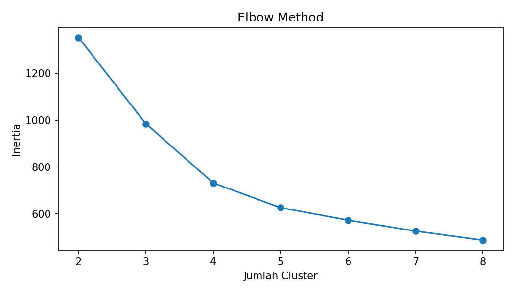
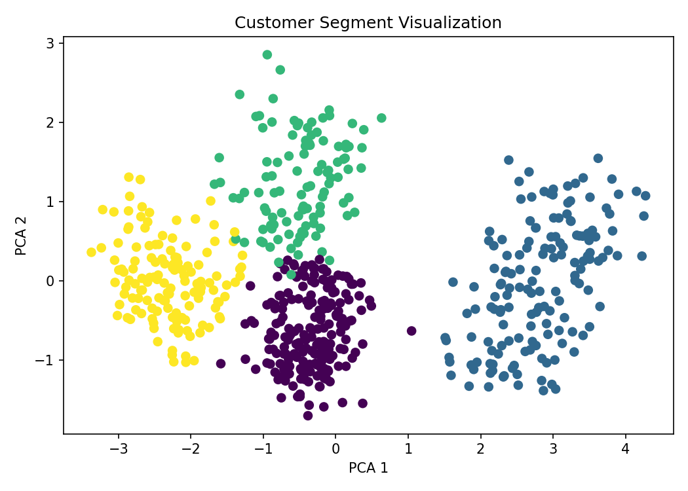

<div align="center">

# Customer Segmentation Using K-Means Clustering

### Behavioral Customer Analytics for Targeted Marketing and Retention Strategy

**Python · Pandas · Scikit-learn · K-Means · Customer Analytics**

</div>

---

## Overview

This project groups customers based on transaction behavior using K-Means clustering.

It demonstrates an end-to-end unsupervised learning workflow covering data preparation, feature scaling, elbow-method analysis, clustering, cluster profiling, and business recommendations.

The dataset is synthetic and intended for portfolio purposes.

---

## Business Problem

Customers have different transaction patterns, engagement levels, and monetary values.

Customer segmentation helps organizations:

- Improve marketing targeting
- Design loyalty programs
- Identify high-value customers
- Reactivate low-engagement customers
- Reduce churn risk
- Prioritize retention campaigns

---

## Dataset

The synthetic dataset is stored in:

```text
data/customer_transaction.csv
```

Main features:

| Feature | Description |
|---|---|
| `recency_days` | Days since the most recent customer activity |
| `frequency` | Number of transactions |
| `monetary_value` | Total customer monetary value |
| `tenure_month` | Length of the customer relationship |
| `visits_per_month` | Average monthly visits |

---

## Methodology

1. Data understanding
2. Data cleaning
3. Exploratory data analysis
4. Feature scaling
5. Elbow method
6. K-Means clustering
7. Cluster profiling
8. Business recommendation

---

## Elbow Method



---

## Customer Segments



The generated cluster profile is available at:

```text
images/cluster_profile.csv
```

---

## Segment Interpretation

| Segment | Characteristics | Recommended Action |
|---|---|---|
| High Value Customer | Frequent transactions, high monetary value, and low recency | Loyalty programs and exclusive offers |
| Potential Customer | Moderate activity with potential for growth | Upselling and personalized campaigns |
| Low Engagement Customer | Infrequent transactions and low monetary value | Reactivation campaigns |
| At Risk Customer | Previously active but currently high recency | Retention and win-back campaigns |

---

## Project Structure

```text
customer-segmentation-clustering/
├── data/
│   └── customer_transaction.csv
├── images/
│   ├── cluster_profile.csv
│   ├── customer_segment.png
│   └── elbow_method.png
├── notebook/
│   └── customer_segmentation.ipynb
├── src/
│   └── run_segmentation.py
├── .gitignore
├── LICENSE
├── README.md
└── requirements.txt
```

---

## How to Run

Install dependencies:

```bash
pip install -r requirements.txt
```

Run the clustering script:

```bash
python src/run_segmentation.py
```

Open the notebook:

```bash
jupyter notebook notebook/customer_segmentation.ipynb
```

---

## Data Workflow

```text
Customer Transaction CSV
          ↓
Data Cleaning
          ↓
Behavioral Feature Selection
          ↓
Feature Scaling
          ↓
Elbow Method
          ↓
K-Means Clustering
          ↓
Cluster Profiling
          ↓
Business Recommendations
```

---

## Business Applications

- Loyalty strategy
- Churn prevention
- Personalized promotions
- Cross-selling and upselling
- Customer reactivation
- Marketing-budget prioritization

---

## Recommended Improvements

- Add Silhouette Score
- Add Davies-Bouldin Index
- Compare multiple cluster counts
- Validate cluster stability
- Add PCA or t-SNE visualization
- Export customer-level segment assignments
- Build an interactive segmentation dashboard

---

## Skills Demonstrated

- Unsupervised machine learning
- Customer analytics
- Data preprocessing
- Feature scaling
- K-Means clustering
- Cluster profiling
- Business interpretation
- Marketing recommendations

---

<div align="center">

**Turning customer behavior into actionable segments.**

</div>
